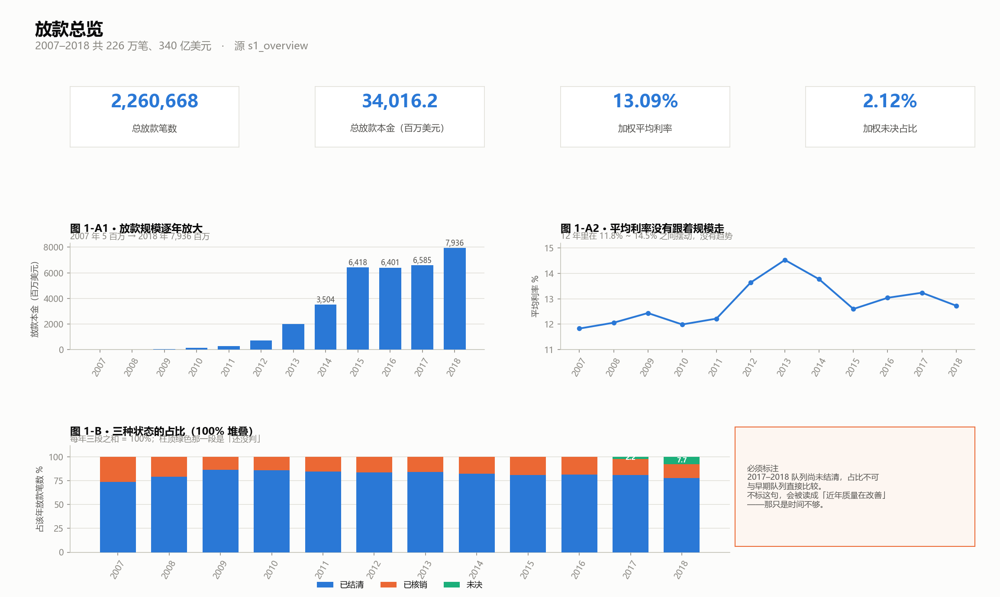
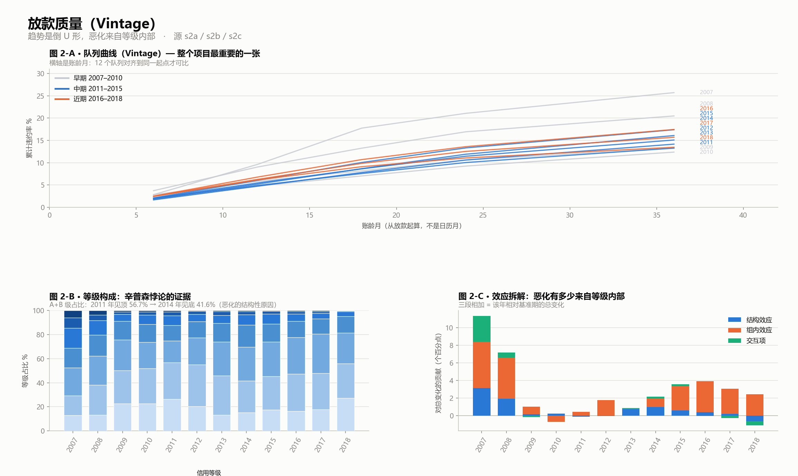
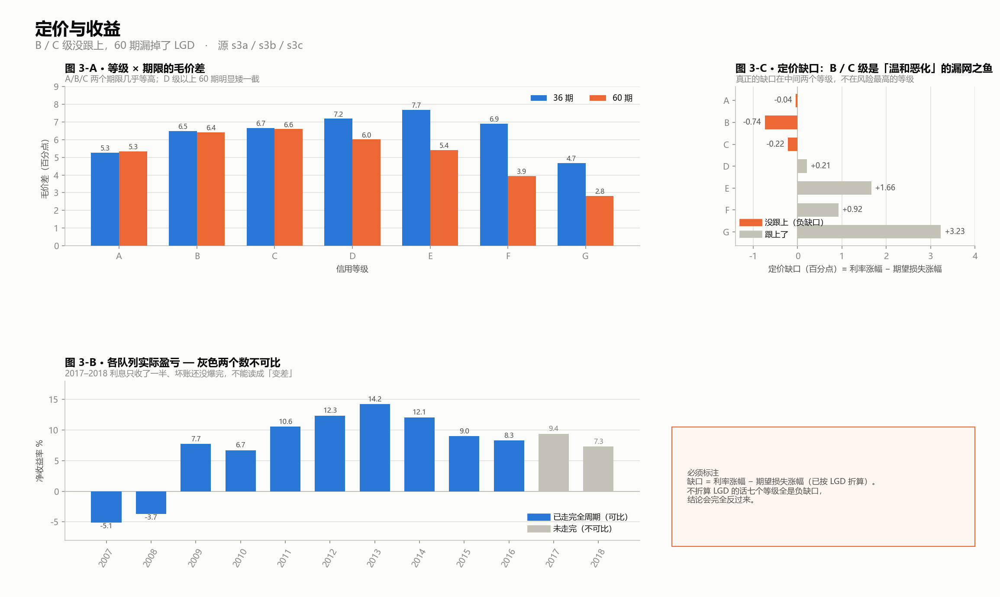
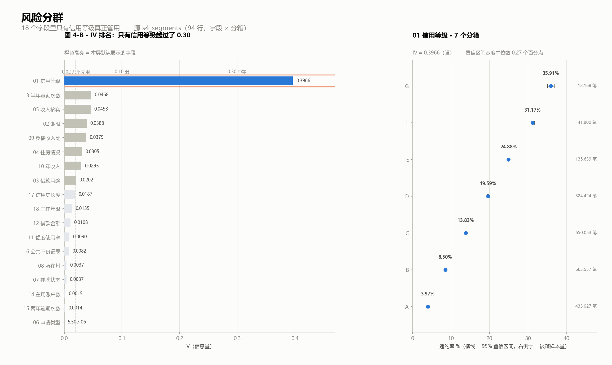
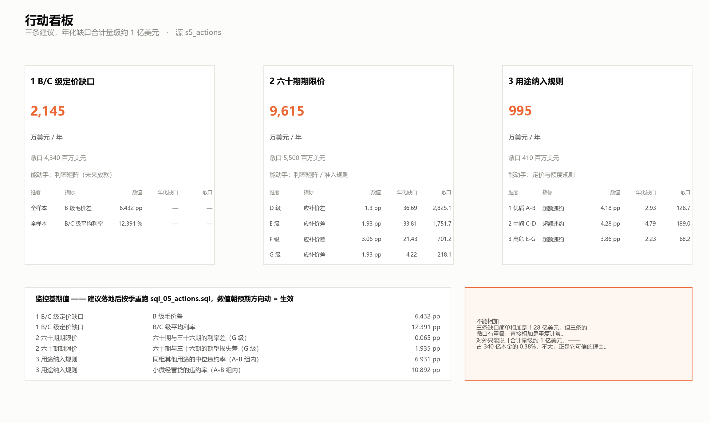

# Lending Club 信贷风险分析

用 **Lending Club 12 年、226 万笔、340 亿美元**真实放款账本，回答信贷业务的核心问题：
**这笔生意赚不赚钱，以及我们到底是靠什么判断的。**

### 📄 [完整项目报告 →](项目报告.md)

其他入口：[口径与数据说明](00_口径与数据说明.md) ·
[逐节分析文档](分析文档) · [五屏看板](output/dashboard/五屏看板.html) ·
[数据获取与复现](data/README.md)

---

## 快速了解

| | |
|---|---|
| 数据来源 | Lending Club 官方 LoanStats（2007–2018，16 个按季/半年切分的文件） |
| 数据规模 | **226 万笔**放款、**340 亿美元**本金 |
| 数据快照日 | **2022-08-31**（实测反推，判据见 `code/db.py`） |
| 主要工具 | **DuckDB + SQL**（取数）、Python（统计检验 / 画图） |
| 产出 | 5 组 SQL、13 张结论图、6 篇分析文档、五屏看板数据源与成品 |

## 三次「听起来很对、数据不支持」的结论反转

| 常识 | 数据说的 |
|---|---|
| **长期限风险更高** | 拉平等级构成后，60 期与 36 期的差异 **117% 来自构成**，剩下方向还反了。**期限影响的是违约损失率，不是违约概率** |
| **高危等级定价不足** | 恰恰相反：**B 级风险涨了、利率一分没涨**（缺口 −0.74pp），而 **E/F/G 反而推得过头**（G 级 +3.23pp）。根因是**反应式定价** |
| **IV 低 = 可丢掉** | 借款用途 IV 仅 0.0202，但等级组内**最差与最好的用途仍差 6~16 个百分点、排序三组一致**。它是等级的**放大器** |

**换算成钱**：三条建议年化缺口合计量级约 **1 亿美元**，占本金 **0.38%**。
**这个数不大，正是它可信的理由。**

## 三条行动建议

| # | 建议 | 年化缺口 | 敞口 | 能动手的地方 |
|---|---|---|---|---|
| 1 | **B / C 级补价** | 约 2,145 万 | 43.4 亿 | 利率矩阵（未来放款） |
| 2 | **60 期加期限价** | 约 9,615 万 | 55.0 亿 | 利率矩阵 / 准入规则 |
| 3 | **借款用途纳入规则** | 约 995 万 | 4.1 亿 | 定价与额度规则 |

> ⚠️ 三条敞口有重叠，**简单相加是重复计算**，对外只能说「合计量级约 1 亿美元」。
> 且只给**基期值和方向**，不给目标值——涨价后客群和竞争反应都会变，那个数算不出来。

## ⚠️ 读结论前先看这三条

- **PD 与 LGD 必须分开**。实测 **LGD ≈ 0.55**，不折算直接算缺口，
  **七个等级全是负缺口**、结论会反一个方向。这个错误不报错、数字也不丑。
- **数据集自身有个坑**：3,032 笔官方标记 `Fully Paid` 的贷款本金从未收全，
  合计 **955 万美元**损失未被记入，方向会让早期放款显得比实际安全。已用双口径并报。
- **226 万笔样本下 p 值完全失效**（18 个字段里 13 个 p < 1e-300），
  所以一律以**效应量（IV / Cramér's V）和置信区间**作为判断依据。

完整口径、快照日推导与局限见 [`00_口径与数据说明.md`](00_口径与数据说明.md)。

---

## 五屏看板

| 屏 1 · 放款总览 | 屏 2 · 放款质量（Vintage） |
|---|---|
|  |  |

| 屏 3 · 定价与收益 | 屏 4 · 风险分群 |
|---|---|
|  |  |

| 屏 5 · 行动看板 | |
|---|---|
|  | 前四屏回答「发生了什么」，<br>这一屏回答「所以呢」。 |

**可交互版**：[`output/dashboard/五屏看板.html`](output/dashboard/五屏看板.html)
——点屏 4 的 IV 排名，下面的分箱违约率图会跟着换。

> ⚠️ 它是单个 HTML 文件，**GitHub 只会显示源码、不会渲染**，请下载后双击在浏览器里打开。

<details>
<summary>看板是怎么做出来的</summary>

| 材料 | 位置 |
|---|---|
| 9 张看板聚合数据源 | `output/tableau/` |
| 逐屏搭建规格 | `分析文档/06_看板搭建说明.md` |
| 生成脚本（可重复运行） | `code/07_build_dashboard.py` |

</details>

---

## 目录结构

```
├── README.md                你在这
├── 项目报告.md               ★ 完整报告：背景 → 数据 → 方法 → 发现 → 建议 → 局限
├── 00_口径与数据说明.md      口径、快照日、异常与局限声明（附录）
├── 分析文档\                 01..06，一节一篇（附录）
├── data\                     ★ 原始数据与 parquet 不在仓库里，见 data/README.md
├── sql\                      sql_01..05，DuckDB 直接跑
├── code\                     建库 / 统计检验 / 画图 / 看板
└── output\
    ├── charts\              13 张结论图 + 五屏截图
    ├── tables\              各步 SQL 结果集 + 统计检验结果
    ├── tableau\             9 张看板聚合数据源
    └── dashboard\           五屏看板 HTML 成品
```

**步骤前缀用 C**（Credit），和淘宝项目的 **S**（Shop）区分开。

## 怎么复现

原始数据可以用脚本自动下载（LendingClub 官方直链，免登录），
获取方式与完整运行顺序见 [`data/README.md`](data/README.md)。

> 不想跑数据也可以：`output/` 里的 13 张结论图、9 组取数结果、
> 9 张看板数据源和五屏看板成品都已随仓库提交。
