# 06 · Tableau 五屏看板搭建说明

> **页签口径**：本文按 5 个页签写。其中**前 4 个是看板屏**
> （放款总览 / 放款质量 / 定价与收益 / 风险分群），
> **第 5 个是行动建议文字页**——对外统称「四屏看板」，就是这四张图。

> 数据源已全部生成在 `output/tableau/`，共 9 个 csv。
> 本文写的是**每一屏用哪张表、哪些字段放行/列、标记怎么设**。
> 环境：Tableau Public 2026.2（本机已装），csv 连接，不需要任何驱动。
> **每张图都配了目标样例图**（存在 `output/charts/tableau_samples/`），照着做即可——
> 样例图和你的数据源来自同一份 csv，数字能对上。

---

## 零、2026.2 版差异清单（先看这个）

本文档最初按较早版本写的，下面这些用词和路径**已经按你本机的 Tableau Public 2026.2 核对过**。
核对方式是直接扫安装目录里的中文语言资源
（`bin\res\zh_CN\tablangres.rcc` 和 `HybridUI\plugin-host-desktop.rcc`），
所以下表右边那一列是软件里真实存在的字样，不是凭印象写的。

| 本文旧写法 | 2026.2 实际叫法 | 说明 |
|---|---|---|
| 新建参数 | **创建参数** | 在「数据」窗格右键 → 创建参数 |
| 允许的值 | **允许值** | 三个选项是「全部 / 列表 / 范围」 |
| 清除选择时显示所有值 | **清除选定内容将会 →「显示所有值」** | 在操作对话框底部 |
| 高亮（动作类型） | **突出显示...** | 添加操作后弹出的类型列表 |
| 参数操作 | **更改参数...** | 同上 |
| 可视化 → 颜色 | **「标记」卡片 → 颜色** | Tableau 里没有「可视化」这个菜单 |
| 分析 → 预测区间 | **「分析」窗格 → 预测** | 预测是给趋势线用的，它做不了置信区间 |
| 左侧「连接」→「文本文件」 | **「文本文件」或「文本文件(旧版)」** | 两个入口都在，见下 |

### ⚠️ 最容易卡住的一条：连接 csv 有两个入口

2026.2 的连接列表里**同时存在「文本文件」和「文本文件(旧版)」**。
新入口走的是新版连接体验；**如果你点「文本文件」之后发现不能像本文说的那样一次拖进多个 csv，
就改用「文本文件(旧版)」**——它保留经典的「选文件 → 拖入多个表」流程。

两个入口读的是同一份 csv，**选哪个都不影响结果**，只看哪个流程你顺手。
本文后面凡是写「文本文件」的地方，都按这个规则理解。

### 一条兜底原则

本文所有步骤写的都是"**要达成什么**"，不是让你死记菜单名。
**遇到对不上的地方，按功能找，不按字样找**（比如"给柱子上色"就是去「标记」卡片里找「颜色」）。
实在找不到，把界面上的文字发我，我按你的版本再改一版。

> **核对过的部分**：顶栏 12 个菜单（文件/编辑/视图/数据/工作表/仪表板/分析/地图/格式/服务器/窗口/帮助）、
> 「堆叠标记」（在「分析」菜单下）、「参考线」「参考区间」「趋势线」「盒须图」「分布」（「分析」窗格）、
> 「导出图像」（在「仪表板」菜单下，和「复制图像」「显示标题」并列）、「新建仪表板」「新建工作表」「新建故事」、
> 「浮动」「平铺」（仪表板对象右键）、「度量名称」「度量值」、「标记」卡片上的
> 「颜色」「大小」「标签」「详细信息」「工具提示」——**这些都对得上，照原文做就行**。
>
> **没能核实的**：个别对话框里按钮的排列顺序。这类差异不影响操作。

### 关于保存：Tableau Public 和 Desktop 不一样

Tableau Public **不能把工作簿保存到本地**，只能保存/发布到你的 Tableau Public 账号，
而且**发布之后是公开可见的**。

对这个项目来说这不是坏事——**正好可以把看板链接放进简历和 GitHub**。但有两点要注意：

1. **先登录再动手。** 做到一半才提示登录，未保存的内容有丢掉的风险。
2. **确认数据里没有敏感信息。** 本项目全是公开数据集和聚合后的 csv，公开没问题。

---

## 一、先连数据源

打开 Tableau → 左侧「连接」→「文本文件」→ 选 `output/tableau/s1_overview.csv`。

> 如果点「文本文件」打开的是新版连接流程、拖不进多个文件，就改用「**文本文件(旧版)**」，见第零节。

**逐个把 9 个 csv 都拖进来**（一个 csv = 一个数据源）。
Tableau 会把它们识别成独立数据源，**不要做关系/关联**——
这 9 张表的粒度不一样（有的是"年"，有的是"年×月"，有的是"字段×分箱"），
强行关联会产生笛卡尔积，数字会翻好几倍，**而且不报错**。

| 文件名 | 粒度 | 用在哪一屏 |
|---|---|---|
| `s1_overview.csv` | 放款年 | 屏1 |
| `s2a_vintage_curve.csv` | 放款年 × 账龄月 | 屏2 |
| `s2b_grade_mix.csv` | 放款年 × 等级 | 屏2 |
| `s2c_effect_split.csv` | 放款年 × 效应 | 屏2 |
| `s3a_grade_term.csv` | 等级 × 期限 | 屏3 |
| `s3b_cohort_pnl.csv` | 放款年 | 屏3 |
| `s3c_pricing_gap.csv` | 等级 | 屏3 |
| `s4_segments.csv` | 字段 × 分箱 | 屏4 |
| `s5_actions.csv` | 建议 × 指标 | 屏5 |

**⚠️ 连进来之后第一件事是检查字段类型。**
Tableau 有时会把「放款年」认成度量。在数据源页签里点列头，
把该是维度的改成维度、该是度量的改成度量：

- `放款年`、`账龄月`、`信用等级`、`期限`、`分箱`、`效应`、`建议` → **维度**
- 其余数值列 → **度量**（默认就是）

**「放款年」保持数字类型但设为维度**（不要转成字符串）。
原因是：字符串排序是逐位比，会把 "2018" 排在 "2019" 前面那种错误出现；
数字排序天生按大小。这里年份都是四位数，两种排法结果恰好一样，
**但保持数字类型更省事，也少一个将来会踩的坑**——
如果哪天加了季度或月份，字符串排序就会立刻出问题。

---

## 二、三条贯穿全看板的规则

这三条是硬约束，做的时候不要破例。

**1. 绝不使用双轴图。**
「利率」和「违约率」量纲不同，很多人第一反应是做双轴。
**不行。** 双轴图里两条线的交点、谁高谁低，
完全取决于两条轴各自怎么缩放——换个刻度结论就反了。
**量纲不同的两个量，拆成两张图或者用同一个小倍数（small multiples）。**

**2. 分类色最多 3 个。**
把维度拖到**「标记」卡片的「颜色」**上，成员超过 3 个的，
把第 4 个及以后手动指定成灰色（"其他"不是一个新的类别，是"剩下的"）。
本项目的调色板和 `code/viz.py` 一致：

| 用途 | 色值 |
|---|---|
| 主色（第一类） | `#2a78d6` |
| 次色（第二类） | `#e8833a` |
| 第三色 | `#4a9e6d` |
| 其余 / 参照 | `#c8ccd2`（灰） |

**3. 两个及以上系列必须有图例；文字绝不穿系列颜色。**
轴标签、数值标签、图例文字一律用深灰 `#333` / 中灰 `#777`，
**不要设成和柱子同色**——那样在浅色柱子上会直接看不见。

---

## 三、屏 1 · 放款总览

**数据源**：`s1_overview.csv`

**布局**：上面四个数字卡片 + 下面两张图。

### 卡片（用「文本」对象手写，或者做单值工作表）

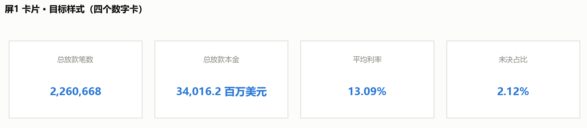


**先把正确值抄在这里，做完逐个对照，一个都不能差：**

| 卡片 | 正确值 |
|---|---|
| 总放款笔数 | **2,260,668** |
| 总放款本金 | **34,016.2**（百万美元，约 340 亿） |
| 平均利率 | **13.09%** |
| 未决占比 | **2.12%**（注意：2018 单年是 7.7%，别混） |
| （可选）平均单笔 | **15,047 美元** |

> **如果你算出来正好是两倍**（笔数 4,521,336、本金 68,032），
> 那就是**合计行被算进去了**：`2,260,668 × 2 = 4,521,336`。
> 如果看到「平均单笔 168,419」「未决占比 12」这种数，那是**比率字段被 SUM 了**。
> 两个都是下面这个坑，接着看。

#### ⚠️ 合计行怎么排除（屏 1 唯一的坑）

`s1_overview.csv` 最后一行是**合计行**（`放款年 = 合计（2007-2018）`）。
它已经把全样本汇总好了，所以两件事会同时出错：

1. **不排除它** → `SUM` 会把 12 个年份和合计行一起加，**数字正好翻倍**；
2. **比率字段用 SUM** → 平均利率变成 12 年的利率相加；
   未决占比变成 `0+0+…+2.2+7.7+2.12 ≈ 12`。

**推荐做法：筛选器只留合计行（3 步）**

1. 把 `放款年` 从左侧「数据」窗格，拖到「标记」卡片上方那一行的**「筛选器」架**上。
2. 弹出的对话框里点 **「无」**把勾全部取消，然后**只勾选「合计（2007-2018）」**，确定。
3. 如果 Tableau 问"是否显示筛选器"，选 **「否」**——我们只是拿它筛数，不需要它出现在图上。

做完四个数就对了。**因为筛选后只剩一行，用什么聚合都一样**，不必再操心 SUM 还是平均值。

> 这个筛选是**工作表级**的，只影响当前这张卡片的表，**不会影响屏 1 的两张图**。
> 图 1-A / 1-B 要显示全部年份，不要加这个筛选器。

**备选做法：不用合计行，自己从 12 个年份算**

如果你希望每个数都是自己算出来的，那就反过来**排除**合计行（第 2 步改成勾选 2007~2018、不勾合计），
再建三个计算字段：

```
平均利率_加权 = SUM([放款本金_百万] * [平均利率]) / SUM([放款本金_百万])
未决占比_加权 = SUM([未决]) / SUM([放款笔数]) * 100
平均单笔      = SUM([放款本金_百万]) * 1000000 / SUM([放款笔数])
```

**注意：`放款笔数`、`放款本金_百万` 这类"量"可以用 SUM；
但 `平均利率`、`未决占比`、`平均单笔` 这类"比率 / 均值"必须加权，不能 SUM。**
这是 Tableau 最常见的坑之一——**均值不能直接相加**。

#### 做出来之后：改数字格式 + 换成卡片版式

**① 数字格式**（不改的话会显示 `13.086011224` 这种长小数）

| 卡片 | 要显示成 |
|---|---|
| 放款笔数 | 2,260,668 |
| 放款本金 | 34,016.2 |
| 加权平均利率 | 13.09% |
| 加权未决占比 | 2.14% |

做法：**右键视图里的数字 →「格式」**，左侧会出现「格式」窗格 →
在「默认值」区把「数字」下拉改成 **「数字(自定义)」** →
**「小数位数」填 2**，并勾上 **「包括千位分隔符」**（这样笔数才会显示成 2,260,668）。

**② 版式：从"一列"变成"一排卡片"**

你现在是「度量名称」放在**行**上，所以数字竖成一列。两种改法：

- **最快**：把「度量名称」从「行」拖到**「列」**上 → 四个数字立刻横排。
  然后在「格式」窗格里**隐藏轴、去掉表头线、调大字号**。
- **最好看（推荐）**：做 **4 张独立工作表**，每张只放一个度量（拖到「文本」，不要放任何维度）。
  点「标记」卡片上的 **「文本」小方块**，在「标记标签」对话框里把字号设成 20pt、加粗、居中。
  然后在仪表板里把 4 张图**并排拖成一排、等宽**。
  **这是 Tableau 里做 KPI 卡的标准做法**——每张卡的数字格式、字号、颜色都能单独控制。

**③ 样例图上的那个"方框"怎么来**

**它不是画出来的，是仪表板容器的样式。** 把图放进仪表板之后：
选中它 → 右侧「布局」窗格 → 设 **「边界」**（浅灰细线）和 **「背景」**（白色或浅灰），
再给一点内边距。四张卡用同一套设置，看起来就是一排卡片。

**④ 为什么卡片会"小小一个"（关键原理）**

**Tableau 里字的大小由「字号」决定，不会跟着容器放大。**
所以把工作表设成「整个视图」之后，文字还是原来那么大，只是**周边留白变多**——
看起来就是"缩在角落里一小块"。

想让它填满，要做的**不是拖大容器，而是把字号调大**：

| 做法 | 效果 |
|---|---|
| 字号调到 18–20pt + 列宽收到刚好 | 四行会一起变高，能占满 |
| **拆成 4 张独立工作表，每张字号 28pt** | 数字居中在整张图里，天然填满（推荐） |

如果你继续用现在这张 4 行的表，还要顺手做两件事：

- **把「度量名称」那一列拖窄**到刚好放下最长标签（"加权平均利率"），否则标签列会占掉一大半宽度；
- **去掉灰白相间的底纹**：「格式」窗格 →「单元格」→ 把底纹设为「无」。

**⑤ 三个容易忽略的细节**

1. **颜色用主色蓝 `#2a78d6`，别用橙色。** 橙色在本项目里有语义——留给"没跟上 / 风险"
   这类结论（比如屏 3 的定价缺口）。总览卡片用蓝色，全项目才一致。
2. **标签用工作表标题。** 独立工作表的话，保留「显示标题」、把标题文字改成"总放款笔数"就行，
   比另外放文本对象省事。
3. **单位必须写出来。** 孤零零一个 `34,016.2` 没人知道单位，标题要写
   "总放款本金（百万美元）"。

### 图 1-A · 放款规模与利率（两个小倍数，不是双轴）

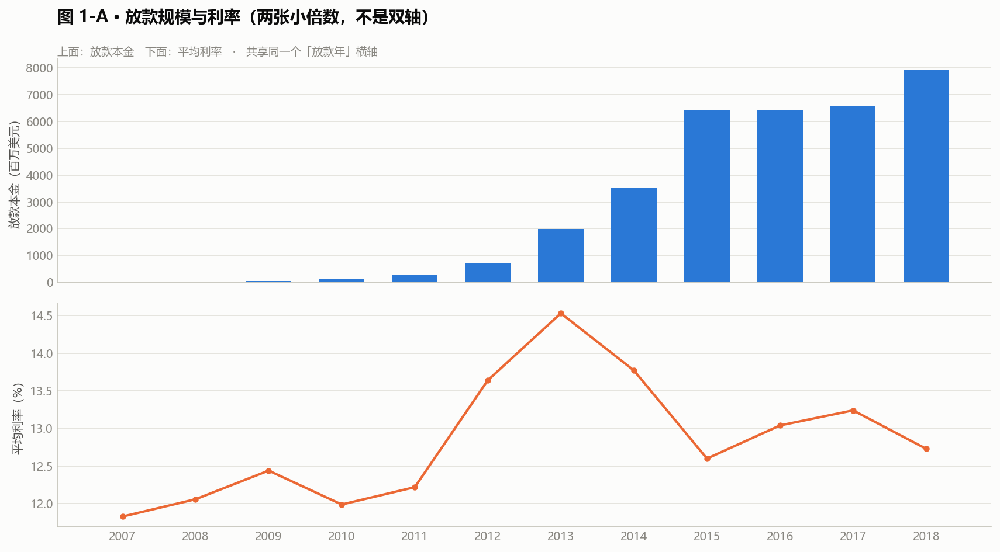


- **列**：`放款年`
- **行**：`SUM(放款本金_百万)` / 第二个图用 `AVG(平均利率)`
- **标记**：条形（本金图）/ 线（利率图）
- **做两张图并排**，共享同一个 `放款年` 轴。**不要叠在一张图上。**

### 图 1-B · 三种状态的占比

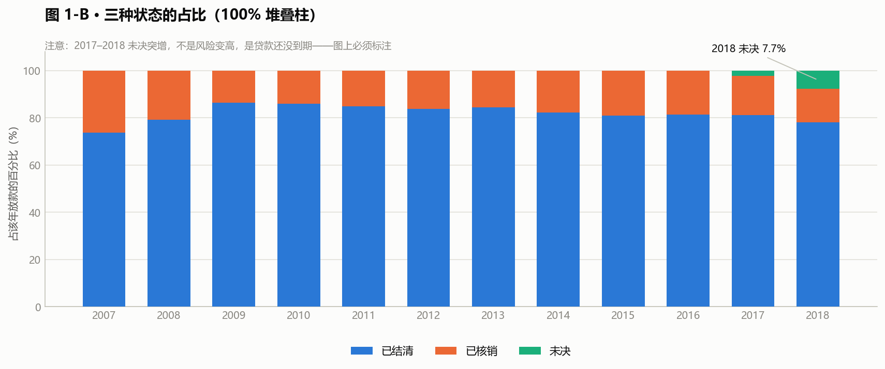

> **注意筛选器方向和卡片相反**：这张图要**排除**「合计（2007-2018）」那一行，
> 否则会多出一根"合计"柱。卡片是"只留合计行"，这里是"排除合计行"。

**第一步：把三个度量拖进来**

同时选中 `已结清`、`已核销`、`未决` 三个度量 → 一起拖到**「行」**。
Tableau 会自动生成 **「度量名称」和「度量值」** 两个字段。

- `放款年` → **「列」**
- `度量名称` → **「颜色」**（这一步做完才是三个系列）

**第二步：转成百分比（这一步是关键）**

这三个字段是**绝对笔数**（78 笔 / 158 笔 / 38356 笔这种量级），
直接拖出来是一堆数量级差很远的长条，看不出结构。必须转成"占该年放款的百分比"：

**做法 A · 快速表计算（快）**

1. 右键**「行」上的「度量值」** → **「快速表计算」→「总额百分比」**
2. 再右键「度量值」 → **「计算依据」→「表(向下)」**

> **验收标准：每一年的三个数加起来必须等于 100%。**
> 如果没到 100%（比如被按年份横向算了），就把「计算依据」换成另一个方向再试。
> **「计算依据」是表计算最容易搞错的地方——别背方向，记住"加起来 = 100%"这个验收标准。**

**做法 B · 自己建三个计算字段（更稳，不会算错方向）**

```
已结清占比 = SUM([已结清]) / (SUM([已结清]) + SUM([已核销]) + SUM([未决])) * 100
已核销占比 = SUM([已核销]) / (SUM([已结清]) + SUM([已核销]) + SUM([未决])) * 100
未决占比   = SUM([未决])   / (SUM([已结清]) + SUM([已核销]) + SUM([未决])) * 100
```

再把这三个计算字段一起拖到「行」，「度量名称」放颜色。
**代价是要建三个字段，好处是永远不会算错方向**——而且公式明写在明面上，
面试官问"这个百分比怎么来的"，你点开就能说。

**第三步：用堆叠柱，不要并排柱**

- 「分析」菜单 →「堆叠标记」（设成「自动」或「开」）
- 「标记」卡片 →「大小」可以调柱子粗细

> **为什么不并排？** 已结清约 80%、已核销约 18%、未决 0~7.7%——
> **并排柱放在同一根 0~100% 的轴上，未决那根几乎看不见。**
> 换成 100% 堆叠柱之后，未决是柱顶那一小段，从 0 长到 7.7% 一眼就看得出来。

**第四步:格式**

- 纵轴设成 0~100%，数字格式小数位 0
- 三个类别正好用满三个分类色（蓝 / 橙 / 绿），不要更多
- 图例放底部横排，不要压到柱子上

> **为什么 2017–2018 的柱子看着矮？**
> **为什么 2017–2018 的柱子看着矮？**
> 因为它们的贷款还没走完，未决占比高。
> **这一屏必须放一个大字说明**：
> "2017–2018 队列尚未结清，占比不可与早期队列直接比较。"
> 不加这句，看图的人一定会得出"近年质量在改善"的错误结论——
> 那只是时间不够，不是风险变低。

---

## 四、屏 2 · 放款质量（Vintage）

**数据源**：`s2a_vintage_curve.csv` + `s2b_grade_mix.csv` + `s2c_effect_split.csv`

### 图 2-A · 队列曲线（这张是整个项目最重要的一张）

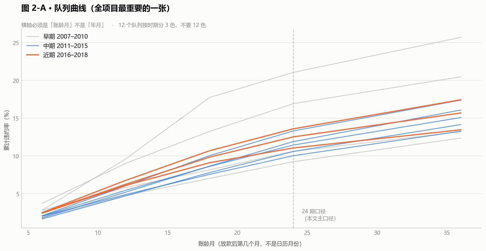


- **列**：`账龄月`（**不是日期，是账龄**）
- **行**：`累计违约率_官方口径`
- **颜色**：`放款年`
- **标记**：线

> **⚠️ 横轴必须是「账龄月」，不是「年月」。**
> 这是 vintage 曲线的全部意义所在：它把每个队列对齐到"从放款起算的第几个月"，
> 这样 2010 年和 2018 年的队列才能在同一个横坐标上比。
> **如果横轴用日历月份，这张图就废了**——
> 2018 年的队列只会画出短短一段，看起来像"违约率暴涨"。

**颜色的处理**：12 个队列，**远超 3 个分类色的上限**。
处理方式：按"时期"分组——

| 组 | 队列 | 颜色 |
|---|---|---|
| 早期 | 2007–2010 | `#c8ccd2` 灰 |
| 中期 | 2011–2015 | `#2a78d6` 蓝 |
| 近期 | 2016–2018 | `#e8833a` 橙 |

**不要在 12 个队列上各给一个颜色。** 12 条彩虹线放在一起，
没人能看出哪条是哪条，图例也会变成一列不可能读完的清单。

### 图 2-B · 等级构成（辛普森悖论的证据）

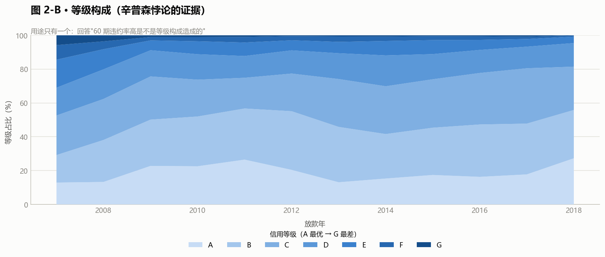


- **列**：`放款年`
- **行**：`等级占比_百分比`
- **颜色**：`等级`
- **标记**：堆叠面积图或堆叠柱

**这张图的唯一用途是回答一个追问**：
"你说 60 期违约率高是等级构成造成的，构成到底变了多少？"
答案在这张图上：**A 级占比从 2010 年的高位一路塌下去。**

### 图 2-C · 效应拆解

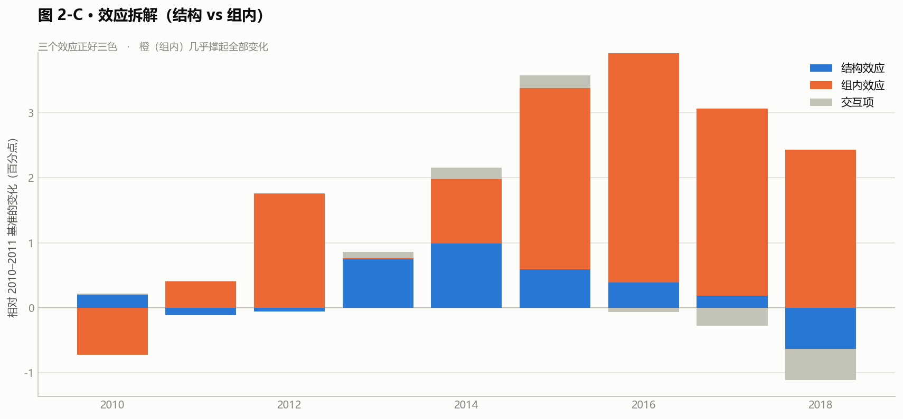


- **列**：`放款年`
- **行**：`贡献pp`
- **颜色**：`效应`（结构效应 / 组内效应 / 交互项）
- **标记**：堆叠柱

三个效应**正好三色**。这张图说明"总变化里有多少是构成变化、多少是真实恶化"。

---

## 五、屏 3 · 定价与收益

**数据源**：`s3a_grade_term.csv` + `s3b_cohort_pnl.csv` + `s3c_pricing_gap.csv`

### 图 3-A · 等级 × 期限的毛价差

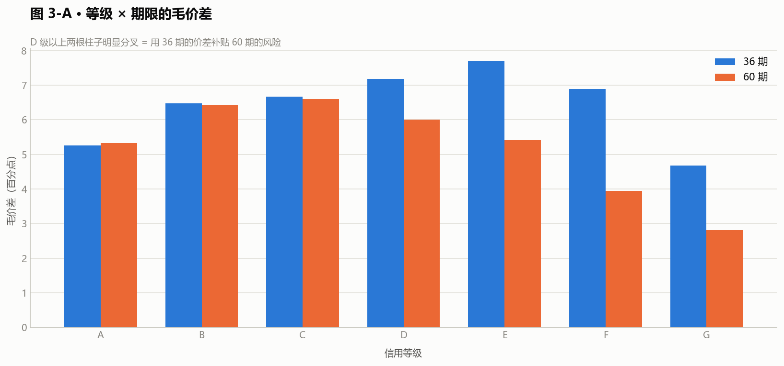


- **列**：`信用等级`
- **行**：`毛价差`
- **颜色**：`期限`（36 / 60，**两个类别**）
- **标记**：并排柱

**这张图一眼就能看出问题**：D 级往上，
36 期和 60 期的柱子高度**明显分叉**——A/B/C 几乎等高，D 以上 60 期矮一截。
这就是"用 36 期的价差补贴 60 期的风险"。

### 图 3-B · 各队列实际盈亏（**必须带"可比性"维度**）

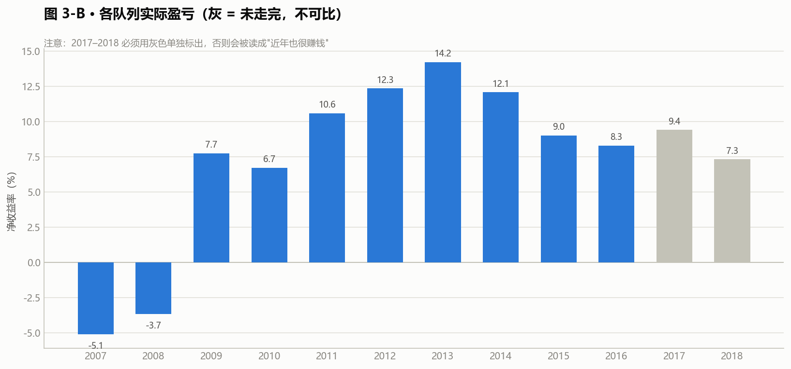


- **列**：`放款年`
- **行**：`净收益率`
- **颜色**：`是否可比`（可比 / 不可比（未走完））
- **标记**：柱

> **⚠️ 这张图的重点全在颜色上。**
> 2017–2018 那两个数是**不可比**的（贷款没走完，
> 利息只收了一半、坏账还没爆完），**必须用灰色单独标出来**。
> 如果全部一个颜色连成一条线，看图的人会以为"近年也很赚钱"。

### 图 3-C · 定价缺口

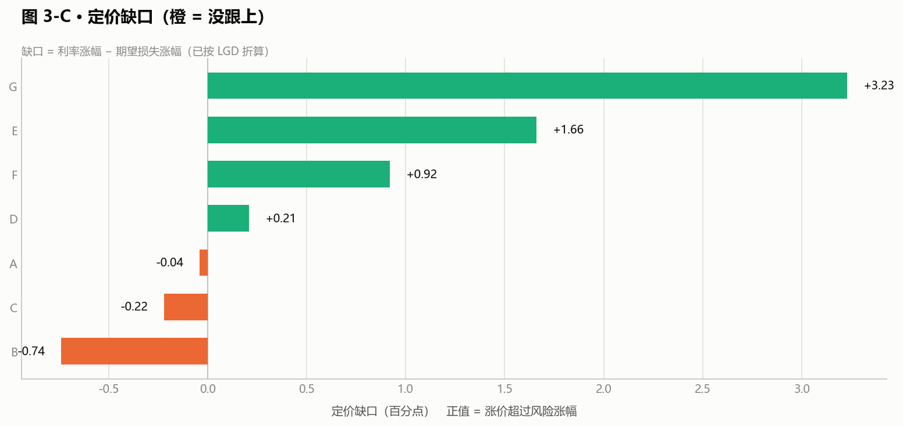


- **行**：`信用等级`
- **列**：`定价缺口pp`
- **标记**：条形
- **颜色**：设一个计算字段把正负分开（负 = 橙，正 = 灰）
  ```
  缺口方向 = IF [定价缺口pp] < 0 THEN '没跟上' ELSE '跟上了' END
  ```

**这一屏和屏 1 一样，必须放大字说明**：
"缺口 = 利率涨幅 − 期望损失涨幅（已按 LGD 折算）。
不折算 LGD 的话七个等级全是负缺口，结论会完全反过来。"

---

## 六、屏 4 · 风险分群

**数据源**：`s4_segments.csv`（94 行，字段 × 分箱）

### 先用筛选器隔离两个变量

这一屏和其他屏最大的不同：**不能把所有字段的分箱混在一张图里。**
做法是在仪表板上放一个**「特征」参数 / 筛选器**，
默认只勾选 `01 信用等级`，用户想换再看别的。

### 图 4-A · 违约率与置信区间

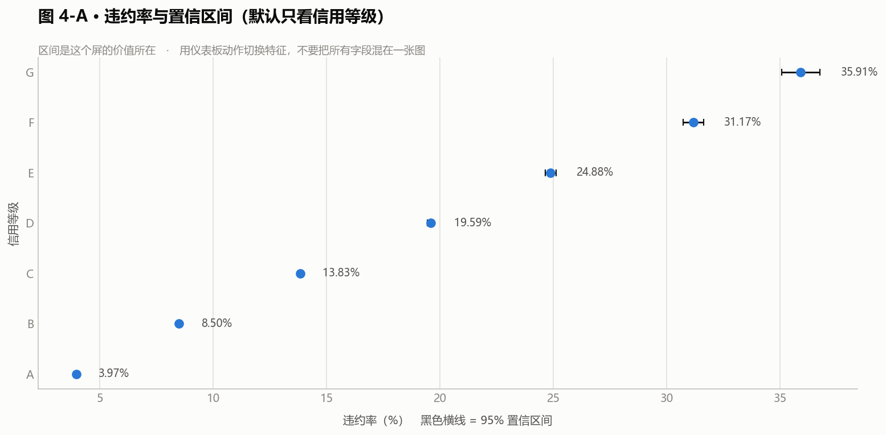


- **列**：`违约率`，同时把 `违约率下界95` 和 `违约率上界95` 拖进「标记 → 详细信息」
- **行**：`分箱`
- **标记**：线（或圆）
- **做法**：用「分析」窗格里的「预测」不行（那是给趋势线的），
  这里用**两个额外的圆点上下界 + 参考线**，
  或者更省事的办法：转成「甘特图/范围图」——
  **行放 `分箱`，列放 `下界`（转成负数）和 `上界` 做堆叠条**。

> **区间是这个屏的价值所在。** 没有区间，
> "婚礼这个用途违约率只有 8.83%"看起来像一条结论；
> 有区间（7.75% ~ 10.05%）才知道**这个箱子只有 2,355 笔，不能当结论用**。

### 图 4-B · IV 排名

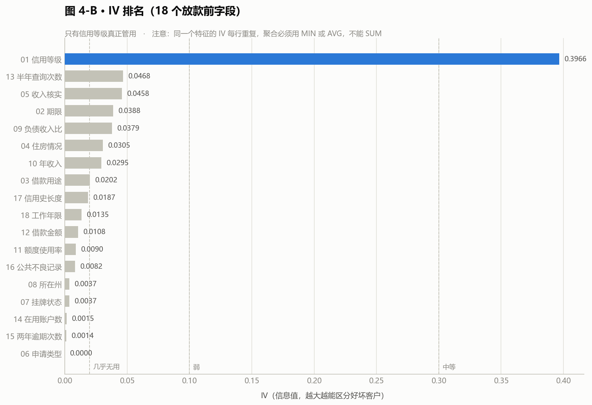


- **行**：`特征`（**必须勾选「按 IV 排序」**）
- **列**：`IV`（用 **MIN 或 MAX**，不要 SUM——
  IV 在同一个特征的每一行都是重复值，SUM 会乘以分箱数）
- **标记**：条形

> ⚠️ `s4_segments.csv` 里 `IV` 是**每个分箱行都重复一遍的**。
> 直接拖进去 Tableau 默认用 SUM 聚合，会把 IV 乘以分箱数。
> **必须改成 MIN 或 MAX**，或者用 `AVG`。

**分级虚线**：在 0.02 / 0.10 / 0.30 三处加参考线，
标注"几乎无用 / 弱 / 中等"。

---

## 七、屏 5 · 行动看板

**数据源**：`s5_actions.csv`

**布局**：三条建议横着排成三列，每列下面挂自己的指标表。

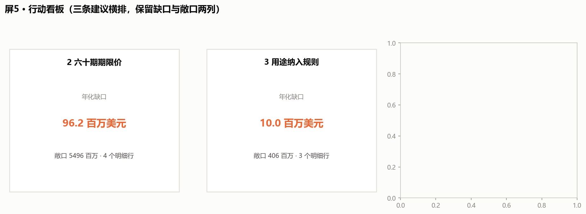


- **列**：`建议`
- **行**：`指标` / `维度`
- **文本**：`数值`
- **标记**：文本

**底部放一张「监控基期值」表**，就是文档 05 第五节那张表。

> **这一屏是给面试看的。** 前四屏回答"发生了什么"，
> 这一屏回答"所以呢"。
> **一定要保留"年化缺口_百万美元"和"敞口_百万美元"两列**——
> 它们是"这条建议值多少钱"的全部依据。

---

## 八、仪表板组装

### 8.1 把图拖进去

**做成一个大仪表板，五个页签（Tab）**——不要做成五个独立的仪表板文件。
页签是「新建仪表板 → 左下角新建页签」，拖工作表进去就行。

| 页签 | 标题文本框内容 |
|---|---|
| 1 放款总览 | `放款总览 · 2007–2018 共 226 万笔、340 亿美元` |
| 2 放款质量 | `放款质量 · 趋势是倒 U 形，恶化来自等级内部` |
| 3 定价与收益 | `定价与收益 · B/C 级没跟上，60 期漏掉了 LGD` |
| 4 风险分群 | `风险分群 · 18 个字段里只有信用等级真正管用` |
| 5 行动看板 | `行动看板 · 三条建议，年化缺口合计量级约 1 亿美元` |

**字号**：标题 20pt 加粗，副标题 12pt 灰色，正文字段 10pt。
**不要**用 Tableau 默认的自动字号——它在不同屏幕上会缩放到看不清。

**每屏的图不要超过 3 张。** 一个塞了 8 张图的仪表板，
读的人第一眼就放弃了，等于没做。

### 8.2 ★ 仪表板动作：让一个筛选器管住整屏

**这是"一个看板"和"一堆图"的分界线，必须做。**
表格式的静态图 matplotlib 也能出，Tableau 的价值就在联动。

做法：`仪表板 → 操作` 打开动作对话框 → `添加操作` → 选 **「筛选器...」**，然后

| 源工作表 | 目标工作表 | 触发方式 | 筛选字段 |
|---|---|---|---|
| 屏 2 的等级构成图 | 屏 2 的队列曲线 | **选择**（点一下） | `等级` |
| 屏 3 的缺口图 | 屏 3 的等级×期限价差 | 选择 | `信用等级` |
| 屏 4 的 IV 排名 | 屏 4 的分箱置信区间图 | 选择 | `特征` |

**屏 4 的那条是最该做的。** 现在做的"用筛选器隔离字段"要用户自己去下拉框里挑；
换成动作之后，**点一下 IV 排名里的某根柱子，下面那张图立刻变成那个字段的分箱**。
这个交互一演示，Tableau 的能力就不用再解释了。

**做完一定要自己点几下验证**：点空白处剩一张空图 = 动作的"清除选择"没配，
在动作对话框底部把 **「清除选定内容将会」** 设为 **「显示所有值」**。

### 8.3 参数：屏 4 的字段切换

如果不用动作，也可以放一个**参数**做字段切换：
`创建参数` → 数据类型选「字符串」→ `允许值` 选「列表」→ 手动填 18 个字段名
→ 建一个计算字段做映射 → 拖进筛选器。

**参数和筛选器都要做，但优先级：动作 > 参数。**
动作能演示"联动"，参数只能演示"切换"，前者含金量高得多。

### 8.4 首屏放不下的说明，用「浮动」文本框

Tableau 里文本框默认是"平铺"的，会把图挤变形。
在**屏 1（未决不可比）** 和**屏 3（LGD 折算）** 这两处，
右键文本框 → **浮动**，然后手动拖到图上的空白位置。
浮动对象在仪表板左侧的列表里能调层级。

---

## 九、截图存档

五个页签做完后，`仪表板 → 导出图像`，存到 `output/charts/`，命名：

```
dashboard_1_overview.png
dashboard_2_quality.png
dashboard_3_pricing.png
dashboard_4_segments.png
dashboard_5_actions.png
```

**截图用来看的，不是用来交差的。** 存完自己从头翻一遍，
重点看三件事：
1. 有没有**文字压住图形**（两个标签撞在一起）；
2. 有没有**图例缺失**（两个及以上系列没图例）；
3. 有没有**该标"不可比"的地方没标**（尤其是屏 1 的 2017–2018）。

---

## 十、这个看板在面试里怎么用

**不要从头到尾翻一遍。** 挑三张讲，中间**动一次手**：

1. **屏 2 的队列曲线** —— 讲 vintage 固定账龄法，
   讲为什么横轴必须是账龄不是日历。
2. **屏 3 的缺口图** —— 讲 LGD 折算，讲"不折算结论会反"。
3. **屏 4 点一下** —— **真的点一下 IV 排名里的"信用等级"那根柱子**，
   让下面那张图当场变成 A~G 的分箱违约率和置信区间。
   然后说一句："**这一屏我把 18 个字段都放进来了，
   因为只展示最好看的那个字段，等于替观众做了选择。**"
4. **屏 5 的行动看板** —— 讲"换算不出动作的结论就还只是观察"。

> **第 3 步是整场演示里唯一一次动手，也是唯一能证明"这不是截图"的动作。**
> 只翻静态图，面试官无法区分这是你做的还是你截的。

其余两屏如果有人问再翻。**看板是做给自己理清思路的，
不是做给面试官看的连续剧。**

### 被问"你这个看板有什么难的"时

别答"用了多少个图"。答这个：

> "难的不是画图，是**在图上标注哪些地方不能比**。
> 屏 1 的 2017–2018、屏 3 的未成熟队列、屏 4 的置信区间——
> **这几处如果不标，图会自己讲出一个错误的结论**，
> 而且看起来很漂亮、不会报错。
> 一个看板最危险的不是画错，是**画对了但让人读错**。"
