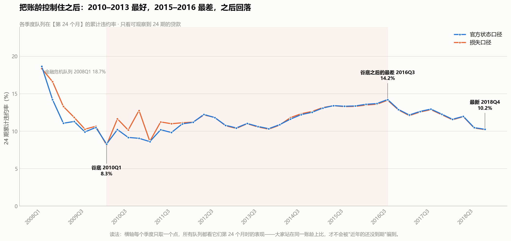
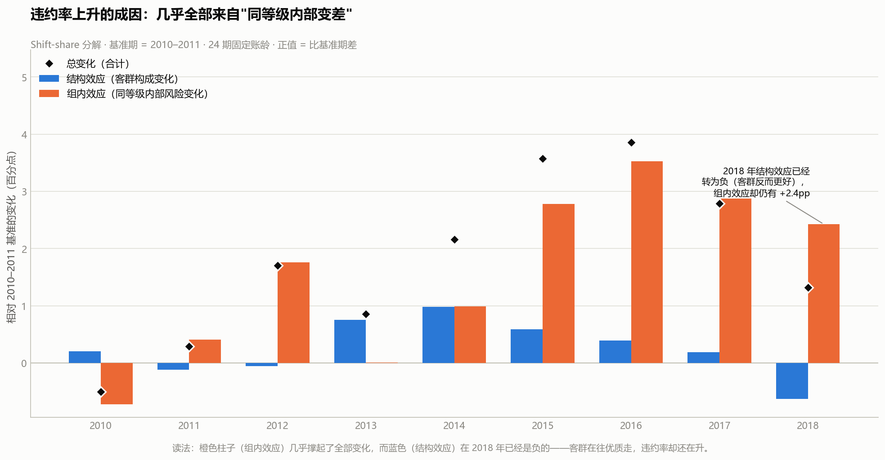
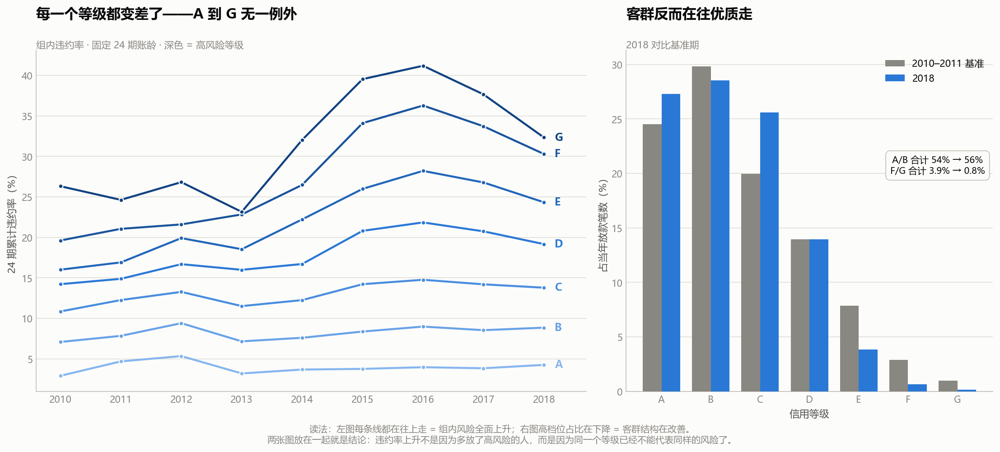
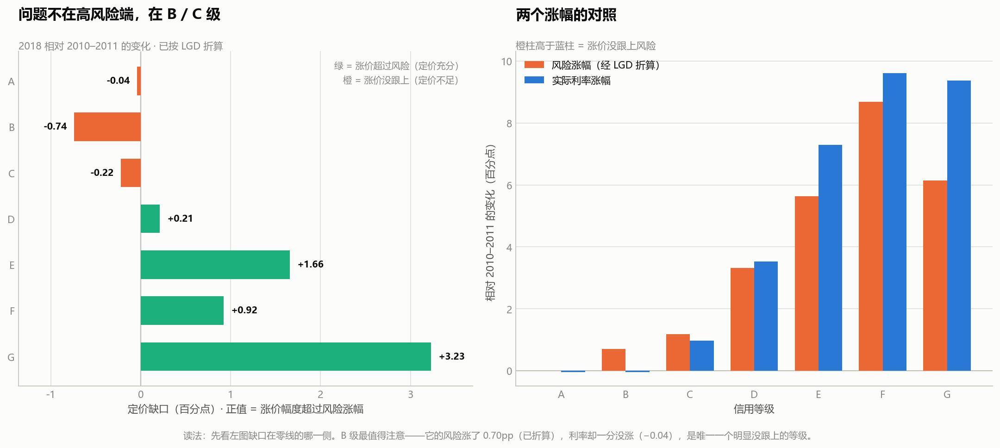
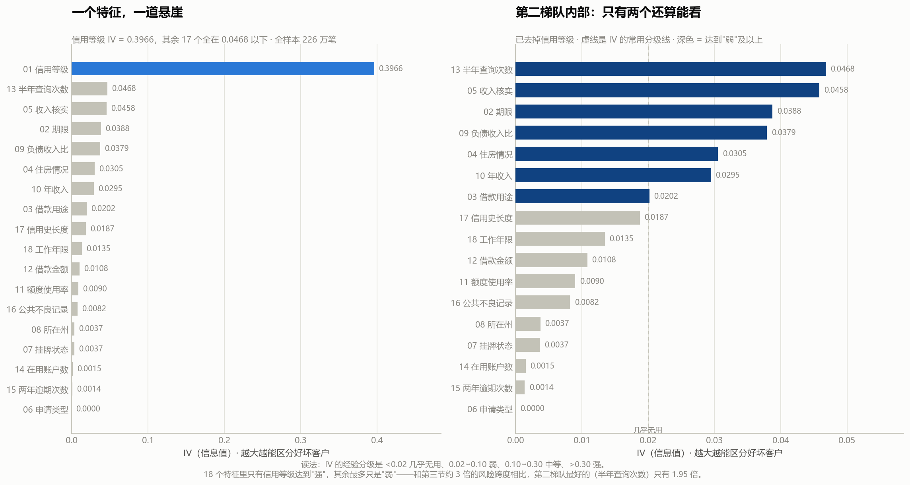

# Lending Club 信贷放款质量与定价分析 · 项目复盘

> **一句话**：用 226 万笔真实贷款账本，证明"这几年风控变好了"是一个**删失造成的假象**，
> 真实趋势是倒 U 形，而且恶化的原因是"同一个信用等级内部风险变高"，不是客群下沉。

---

## 一、项目概况

| 项目 | 内容 |
|---|---|
| 数据来源 | Lending Club 官方公开贷款账本（16 个文件） |
| 数据规模 | **2,260,668 笔**贷款，申请本金 **340.2 亿美元** |
| 覆盖时间 | 放款期 2007-06 ~ 2018-12；**数据快照日 2022-08-31** |
| 关键字段 | 放款金额、期限、利率、信用等级、借款用途、年收入、DTI、FICO、贷款状态、已收本金、回收款 |
| 主要工具 | DuckDB + SQL（取数）、Python + Matplotlib（画图） |
| 产出 | 5 组 SQL、13 张结论图、6 篇分析文档、9 张 Tableau 聚合表 |
| 项目定位 | 银行 / 保险 / 风控方向 |

---

## 二、数据说明

### 2.1 五个必须先钉死的口径

**① 时间原点（快照日）= 2022-08-31。**
所有"账龄"都相对它计算，**选错一天整条 vintage 曲线的横轴就全错，而且不会报错**。
判定方法：**仍未结清的贷款一直在按月还款，它们集体停在哪个月，数据就封存在哪个月。**
实测 47,332 笔未结清贷款里有 46,172 笔的最后一笔还款落在 2022-08，之后断崖下跌。

> ⚠️ **一个会把人带沟里的干扰项**：`last_credit_pull_d`（最后一次拉征信日期）的最大值是 2023-07，
> 看起来更晚、很容易被当成快照日。**它是错的**——那个字段跟着贷款活动走，
> 还被 2021-03 的一次批量征信刷新污染过（321,003 笔挤在同一个月）。
> **两个字段给出不同答案时，不能挑"看起来更合理"的那个，要找一个能独立判定的证据。**

**② 状态归并成三类。**

| 归并后 | 原始取值 |
|---|---|
| 已结清 | `Fully Paid`；`Does not meet the credit policy. Status:Fully Paid` |
| 已核销 | `Charged Off`；`Default`；`Does not meet the credit policy. Status:Charged Off` |
| 未决 | `Current`；`Late (16-30 days)`；`Late (31-120 days)`；`In Grace Period` |

**③ 未决贷款的标签必须是 NULL，不能是 0。**
把"还没违约"当成"好客户"会严重低估违约率，而且**年轻队列的未决占比天然更高**
（2018 年有 7.7% 未决，2007 年几乎为 0），所以这个错误会正好制造出**"近年质量在改善"的假象**。

**④ 账龄（MOB）。** `mob_obs` = 放款日到快照日，是这笔贷款的**可观察上限**；
`mob_event` = 放款日到最后一笔还款日，用作**违约时点的代理**（数据里没有违约日期列）。

**⑤ 双标签并报。** `outcome` = 官方 PD 口径（`Fully Paid`=0、核销=1）；
`loss_occurred` = 损失口径（真的亏了钱=1）。两个都跑，**差异本身就是一条结论**。

### 2.2 一个必须被修正的数据问题

**有 3,032 笔贷款状态是 `Fully Paid`（官方口径 = 好客户），但本金从未收全**，
合计造成 **955 万美元**本金损失，在官方口径下一分钱都没被记进损失。
已排除债务和解（全部 `debt_settlement_flag='N'`）和困难展期（`hardship_flag='N'`），
**但无法从数据最终判定成因，所以只报告事实和影响，不编解释。**

它对结论的影响很大：

| 放款年 | 官方核销率 | 含这批损失的比率 |
|---|---|---|
| 2007 | 26.20% | 28.52% |
| **2008** | **20.73%** | **37.61%** |

官方口径下 2008 年看起来比 2007 年更安全；补上之后 2008 年跳到 **37.61%，是全样本最高**。
**后者才符合常识——2008 年是金融危机。**

### 2.3 数据里没有的东西（决定了项目的边界）

- **没有拒贷样本**：只有放款成功的贷款，所以任何区分度结论都**不能外推成准入模型**。
- **没有违约日期**，只有最后一笔还款日（代理，会系统性低估事件月数）。
- **没有资金成本、获客成本、运营成本**，所以只能算"损失覆盖倍数"，不能算真实利润率。

---

## 三、分析流程（6 步）

| 步 | 回答的问题 | 主要方法 | 一句话结论 |
|---|---|---|---|
| 01 | 这个盘子有多大 | 规模统计 + 状态分布 | 226 万笔；表面"未决占比上升"是陷阱 |
| 02 | 放款质量到底变好还是变坏 | **固定账龄法 + shift-share 分解** | 天真做法说改善，**实际是倒 U 形** |
| 03 | 收的利率有没有跟上风险 | 期望损失 vs 利率；账务口径盈亏 | 总体跟上了，**B/C 级和 60 期没跟上** |
| 04 | 哪些字段真有区分力 | IV + 区分度 + 稳定性检验 | 18 个放款前字段里，**只有信用等级管用** |
| 05 | 前三节能变成什么动作 | 缺口换算 | 三条建议，年化缺口约 2.1 / 9.6 / 0.1 千万美元 |
| 06 | 怎么呈现给业务 | Tableau 五屏看板 | 见第四节 |

---

## 四、核心结论

### 结论 1 · "近年风控变好"是删失造成的假象

**天真做法**（直接比各年核销率）：2015 年 19.07% → 2016 年 18.61% → 2017 年 17.02% → **2018 年 15.43%**，
一条漂亮的下降曲线，结论是"风控在变好"。

**这个结论是错的。** 2015 年的贷款已经走完 80 个月，该坏的都坏了；
2018 年的只走了 44 个月，**还没轮到它们坏**。

改用**固定账龄法**（所有队列都看第 24 个月，这是唯一对全部 12 个队列都成立的账龄）：

| 队列 | 24 期累计违约率 |
|---|---|
| 2008Q1 | 18.66%（金融危机） |
| **2010Q1** | **8.29%（谷底）** |
| 2013Q4 | 10.33% |
| **2016Q3** | **14.22%（谷底之后最差）** |
| 2018Q4 | **10.25%（已回落，但仍高于 2010–2013）** |

> **正好相反**：天真做法说"2018 年最安全"，固定账龄说"2018 年比 2010–2013 差，只是比 2015–2016 好"。

### 结论 2 · 恶化不是客群下沉，是"同一个等级内部风险变高"

把整体违约率写成各等级的加权平均，变化拆成**结构效应**（权重变了）和**组内效应**（组内风险变了）：

| 放款年 | 总变化 | 结构效应 | **组内效应** | 组内占比 |
|---|---|---|---|---|
| 2015 | +3.58pp | +0.59 | **+2.78** | **78%** |
| 2016 | +3.85pp | +0.39 | **+3.52** | **91%** |
| 2018 | +1.32pp | **−0.63** | **+2.43** | **184%** |

**客群其实在变好**：加权平均等级分从 2.821 降到 **2.409**，
优质等级（A/B）占比从 45.8% 升到 **55.8%**，高危等级（F/G）占比从 3.90% 降到 **0.78%**（原来的五分之一）。

**所以"违约率上升是因为下沉客群"这个最直觉的解释，被数据明确排除了。**
2018 年最能说明问题：结构效应已经是负数（客群比基准期还好），违约率却仍高出 1.32 个百分点。

### 结论 3 · A 到 G 无一例外，而且恶化幅度随等级单调放大

| 等级 | 基准期（2010–2011） | 2018 | 变化 |
|---|---|---|---|
| A | 3.79% | 4.24% | +0.46pp |
| C | 11.55% | 13.78% | +2.23pp |
| E | 16.46% | 24.33% | +7.88pp |
| **F** | 20.33% | 30.30% | **+9.97pp** |

**等级排序还保得住**（A < B < … < G 依然成立），但**风险梯度被彻底拉开**：
A 与 F 的差距从 16.5pp 扩大到 **26.1pp**。

> **对定价的含义**：E/F/G 的实际风险涨得比等级暗示的快得多。如果定价还按原来的等级价差走，这几个等级的账是亏的。

### 结论 4 · 期限的风险藏在 LGD 里，不在违约率里（一个被推翻又重建的结论）

**第一版结论是错的**：不分等级直接比 36 期与 60 期，得到"60 期违约率是 36 期的 1.4~1.7 倍"，
写成"期限是独立于等级的第二个风险轴"。

**错在漏掉了混淆变量——等级构成**：

| | 36 期 | 60 期 |
|---|---|---|
| A 级占比 | 25.4% | **3.7%** |
| E/F/G 合计占比 | 3.8% | **19.7%** |

**会选 60 期的人本来就信用更差。** 把 60 期的等级违约率套到 36 期的等级构成上重算：

| 口径 | 24 期违约率 |
|---|---|
| 36 期（实际） | 10.92% |
| 60 期（按自己的构成） | 15.75% |
| **60 期（换算成 36 期的构成）** | **10.09%** |

**拉平等级构成之后，60 期的违约率反而更低。** 这是教科书式的**辛普森悖论**。

**但顺着往下查，期限确实有影响，只是在另一个维度上**：

| 维度 | 期限的影响 |
|---|---|
| PD（会不会违约） | 拉平等级后**没有差别** |
| **LGD（违约时亏多少）** | **七个等级无一例外，60 期高 7~11 个百分点** |

原因是摊还速度的算术：**同样在第 24 个月违约，36 期已经还掉约三分之二本金，60 期才还掉四成。**

> **所以正确的说法是：期限走 LGD 这条路影响风险，不走违约率这条路。**
> 如果按第一版的理解去补价差，会让业务去补一个**根本不存在的**差距。

### 结论 5 · 定价总体跟上了，但两个地方没跟上

**先说一个关键换算**：违约的贷款还能收回四成半左右（LGD ≈ 0.55），
所以**违约率涨 1 个百分点，只需要利率涨约 0.55 个点就能覆盖**。
只按违约率调价会把缺口高估近一倍，结论会整个反过来。

| 等级 | 期望损失涨幅 | 利率涨幅 | **定价缺口** |
|---|---|---|---|
| A | −0.00 | −0.04 | −0.04 |
| **B** | **+0.70** | **−0.04** | **−0.74** |
| **C** | +1.19 | +0.97 | **−0.22** |
| E | +5.64 | +7.30 | +1.66 |
| G | +6.14 | +9.37 | +3.23 |

**两个没跟上的地方**：一是 **B / C 级**——风险涨了、利率一分没动；
二是 **60 期**——LGD 比 36 期高 7~11 个百分点，利率却几乎和 36 期一模一样（G 级只差 0.06 个点）。

### 结论 6 · 18 个放款前字段里，只有信用等级真正管用

| 字段 | IV |
|---|---|
| **信用等级** | **0.3966** |
| 第二名 | 0.0468（差 8 倍） |
| 最后一名 | 差 262 倍 |

**注意一件事**：这 18 个字段里，**17 个的"最好 vs 最差"差异在统计上都是真的**（置信区间不重叠）。
比如"在用账户数"，最多的一组违约率 12.98%、最健康的一组 11.67%，差 1.31 个百分点，p 值约等于 0。

> **"差异是真的"和"这个差异有用"是两件事。** 后者才是建模和业务该关心的。

### 结论 7 · 三条能落地的动作建议

| # | 建议 | 靶子 | 年化缺口 | 敞口本金 |
|---|---|---|---|---|
| 1 | 给 **B / C 级**补价 | 2018 年新放款的 B / C 级 | 约 **2,100 万美元** | 43.4 亿 |
| 2 | 给 **60 期**加期限价 | D 级以上 60 期全部存量 | 约 **9,600 万美元** | 55.0 亿 |
| 3 | 把**借款用途**纳入定价规则 | 小微经营贷 | 约 **1,000 万美元** | 4.1 亿 |

> ⚠️ **三条缺口不能直接相加**：它们在敞口上互相重叠（一笔"小微经营贷 + D 级 + 60 期"的贷款，
> 三条建议都覆盖它）。加总只有 1.27 亿，但那是**重复计算**。

**判据是硬的**：一条结论如果换算不出"要动什么、动多少、影响多大盘子"，它就还只是观察，不是建议。

---

## 五、名词与指标解释

| 名词 | 一句话解释 |
|---|---|
| **Vintage（账龄分析）** | 按"放款批次"分组、看同一账龄下的表现。核心作用是**让不同年份的贷款站在同一个时间点上比** |
| **MOB（months on book）** | 贷款已经存续了几个月。本项目用 `mob_obs`（可观察上限）和 `mob_event`（事件时点代理） |
| **右删失** | 观察窗口太短，晚期事件还没来得及发生。**误差方向固定**，只会制造"近期更好"的假象 |
| **可观察性纪律** | 只发"看得见"的格子。2018Q4 队列在第 60 个月那一格**必须是空白，不能是 0**——填 0 等于宣称"一笔都没坏" |
| **核销（Charge-off）** | 银行认定这笔钱收不回来了，把它记为损失。`Default` 是"已违约但流程没走完"，本项目归入核销 |
| **PD（违约概率）** | 这笔贷款会不会违约 |
| **LGD（违约损失率）** | 一旦违约，最终亏掉本金的百分之几。本项目各等级 LGD 在 0.45 ~ 0.71 之间，整体约 **0.55**，即违约后还能收回四成半左右 |
| **EAD（违约敞口）** | 违约那一刻还欠多少钱。期限越长、摊还得越慢，敞口越大 |
| **期望损失** | PD × LGD × EAD。定价要覆盖的就是这个数 |
| **累计违约率** | 放款后到第 N 个月为止，累计违约的比例。本项目主口径是第 24 个月 |
| **毛损失 / 净损失** | 毛损失 = 放款本金 − 已收本金；净损失 = 毛损失 − 回收款。两者都报，用来界定**回收滞后**带来的偏误 |
| **回收款（recoveries）** | 核销之后催收追回来的钱。催收按"含利息的总债务"打折回收，所以**可能超过剩余本金**（导致净损失为负） |
| **摊还** | 每期还款里"还本金"的部分。36 期比 60 期摊还得快，所以同样时点违约，60 期的窟窿更大 |
| **shift-share 分解** | 把整体变化拆成"结构效应"（权重变了）和"组内效应"（组内风险变了），判断问题出在客群还是出在风控 |
| **标准化（拉平构成）** | 把 A 组的构成套到 B 组的组内比率上，问"如果 B 组的客群和 A 组一样，结果会是多少" |
| **辛普森悖论** | 分组看和合并看，结论方向相反。本项目：合并看 60 期违约率更高，分组看反而更低 |
| **IV（信息值）** | 衡量一个字段对目标的区分力。本项目信用等级 IV = 0.3966，第二名只有 0.0468 |
| **区分度 / 稳定性** | 区分度=能不能把好坏客户分开；稳定性=这个能力在不同时间段是否一致。**两个都要看** |
| **选择偏差** | 样本不是随机来的。本项目只有放款成功的贷款，**没有拒贷样本**，所以不能当准入模型用 |
| **一阶近似口径 vs 账务口径** | 前者=用"违约率 × LGD"估算期望损失（全队列可算）；后者=真实收到的利息减去真实损失（只能用在已走完周期的队列） |

---

## 六、面试问答

**Q1：这个项目做了什么？（60 秒）**

> 用 Lending Club 226 万笔贷款账本做 vintage 分析。第一步就证伪了一个直觉结论：直接比各年核销率会看到从 2015 年的 19% 降到 2018 年的 15%，像是风控在变好——**但这是右删失，2018 年的贷款到快照日只走了 44 个月，还没到期**。
>
> 换成固定账龄法（所有队列都看第 24 个月），结论完全反转：谷底是 2010Q1 的 8.3%，2016Q3 见顶 14.2%，2018Q4 回落到 10.2%。
>
> 然后做 shift-share 分解，发现恶化**不是**客群下沉——客群结构其实在改善，91% 来自**组内效应**，也就是同一个等级内部风险上升了。

**Q2：什么叫右删失？为什么它危险？**

> 观察窗口不够长，晚期才会发生的事件还没发生就被当成"没有发生"。2015 年的贷款走完了 80 个月，2018 年只走了 44 个月，直接比等于把"没来得及坏"当成"不会坏"。
>
> **危险在于误差方向是固定的**——它永远让近期队列看起来更好，所以一定是"制造假的好消息"，而不是随机噪声。这也意味着它比一般的数据错误更不容易被发现。

**Q3：为什么选 24 期做口径？**

> 因为它是**唯一对全部 12 个队列都成立的账龄**——最年轻的 2018 队列也有 44 个月历史。60 期在 2018 完全不可用、2017 也只剩 64%。
>
> 另一个佐证是坏账发生的时点分布：坏账最后一笔还款距放款的中位数是 16 个月，24 期能覆盖大部分。但分布很宽（90 分位到 33 个月），**所以 24 期数字应该读作"早期违约率"，是可比的指标，不是最终损失率**。

**Q4：怎么证明恶化不是客群下沉？**

> 两条证据。一是 shift-share 分解：把变化拆成结构效应和组内效应，2018 年的**结构效应是负数**（−0.63），也就是说客群构成比基准期还好，违约率却仍然高出 1.32 个百分点，全部来自组内效应。
>
> 二是直接看客群：加权平均等级分从 2.82 降到 2.41，优质等级 A/B 占比从 45.8% 升到 55.8%，高危的 F/G 占比从 3.9% 降到 0.78%——**客群明确在变好。**

**Q5：期限到底有没有影响？**

> 有，但走的是另一条路。我第一版不分等级直接比，得到"60 期违约率是 36 期的 1.4~1.7 倍"，那是**辛普森悖论**——60 期客户里 A 级只占 3.7%，36 期里占 25.4%，会选 60 期的人本来就信用更差。把等级构成拉平之后，60 期违约率反而更低。
>
> 但把 PD 和 LGD 拆开看就不一样了：**违约概率没差别，违约损失率 LGD 却稳定高 7~11 个百分点，七个等级无一例外。** 原因是摊还速度——同样在第 24 个月违约，36 期已经还掉三分之二本金，60 期才还掉四成。**所以期限是独立风险维度，但它走 LGD 这条路。**

**Q6：IV 是什么？为什么只有信用等级管用？**

> IV 衡量一个字段对目标的区分力。18 个放款前字段里，信用等级的 IV 是 0.3966，第二名只有 0.0468，差了 8 倍。
>
> 这里有个值得说的点：**这 18 个字段里 17 个的差异在统计上都"真实"**（置信区间不重叠），因为样本有 226 万笔。**但"差异是真的"和"差异有用"是两件事**——比如在用账户数，最好和最差组只差 1.31 个百分点，p 值约等于 0，可是没有任何业务动作能基于它做。

**Q7：定价缺口是怎么算出来的？**

> 用一阶近似：24 期违约率 × LGD = 期望损失率，再和利率比。
>
> 关键是**不能只按违约率调价**——违约的贷款还能收回四成多，所以**违约率涨 1 个百分点，只需要利率涨约 0.55 个点就能覆盖**。不算这一步会把缺口高估近一倍，结论会整个反过来。

**Q8：三条建议能加总吗？**

> 不能。它们在敞口上互相重叠——一笔"小微经营贷 + D 级 + 60 期"的贷款，三条建议都覆盖它，加总就是重复计算。**要看总盘子，应该问"这三条合起来能不能把整体毛价差抬回 2013 年的水平"。**

**Q9：这份数据有什么问题？**

> 有一个我发现了、量化了、但**没有编造解释**的问题：**3,032 笔贷款状态是 `Fully Paid`，但本金从未收全**，合计 955 万美元没被记进损失。我排除了债务和解和困难展期两种解释（相关标志位全是 N），但**从数据本身无法最终判定成因**，所以我只报告事实和影响。
>
> 它对结论影响很大：官方口径下 2008 年核销率 20.73%，看起来比 2007 年更安全；补上这批之后跳到 37.61%，是全样本最高——**这才是金融危机该有的样子**。处理方式是双口径并报，而不是二选一。

**Q10：这个项目最大的局限？**

> 三条：**没有拒贷样本**——只有放款成功的贷款，所有违约率都是"通过筛选之后的违约率"，任何区分度结论不能外推成准入模型，这是银行背景的面试官最会问的；**`mob_event` 是代理事件时点**，真实违约在最后一笔还款之后，曲线尾部被系统性截短；**这是历史切片**，快照日 2022-08，2007–2018 的信贷环境与今天不同。

---

## 七、已知局限

1. **选择偏差**：没有拒贷样本，不能做准入模型。
2. **官方状态标签有噪声且分布不均匀**（3,032 笔），处理方式是双口径并报。
3. **`mob_event` 是代理事件时点**，系统性低估事件月数（曲线略微左移）。
4. **回收滞后与右删失方向相反**：前者高估净损失，后者低估损失。同时报毛损失率与净损失率来界定上下界。
5. **24 期口径是"早期违约率"**，不是最终损失率。
6. **历史切片**，快照日 2022-08，业务环境已变。
7. **金额只到本金层面**：没有资金成本、获客成本、运营成本，只能算损失覆盖倍数，不能算真实利润率。
8. **组内恶化无法归因到具体机制**：能证明"同等级内部风险上升"，但区分不了审批放松、外部环境变化、还是等级定义漂移——**不编造听起来合理的原因**。
